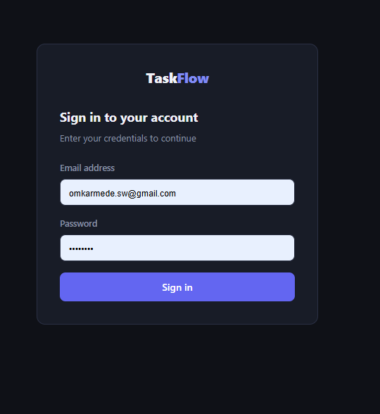
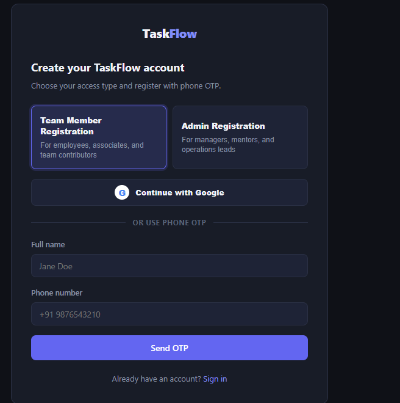
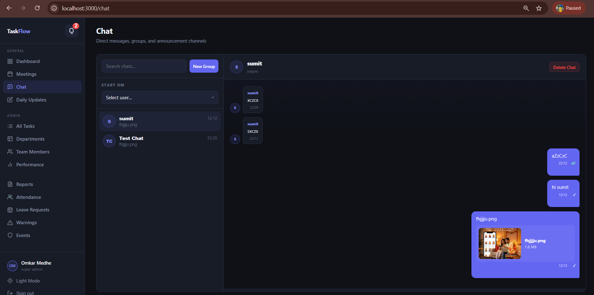

# TaskFlow MVP — Team Task Manager

A role-based task management system built with **Next.js 14**, **Supabase**, and TypeScript.

---

## Roles

| Role | Can do |
|------|--------|
| `super_admin` | Everything + create admins |
| `admin` | Create interns, assign tasks, approve/reject submissions |
| `intern` | View own tasks, submit completed work |

---

## Tech Stack

- **Next.js 14** (App Router, Server Components)
- **Supabase** (Auth, PostgreSQL, Row Level Security)
- **TypeScript**
- **React Hook Form**
- **react-hot-toast**
- **date-fns**
- Pure CSS (no Tailwind — custom design system)

---

## Screenshots

### Login Page


### Register Page


### Chat Page


---

## Folder Structure

```
task-manager/
├── src/
│   ├── app/
│   │   ├── api/
│   │   │   ├── admin/
│   │   │   │   ├── create-user/route.ts     # POST: create intern/admin
│   │   │   │   └── users/
│   │   │   │       ├── route.ts             # GET: list users
│   │   │   │       └── [userId]/route.ts    # PATCH: toggle active
│   │   │   └── tasks/
│   │   │       ├── route.ts                 # GET/POST tasks
│   │   │       └── [taskId]/
│   │   │           ├── submit/route.ts      # PATCH: intern submits
│   │   │           └── review/route.ts      # PATCH: admin reviews
│   │   ├── auth/
│   │   │   ├── callback/route.ts            # OAuth/email callback
│   │   │   ├── login/page.tsx
│   │   │   └── register/page.tsx
│   │   ├── dashboard/
│   │   │   ├── layout.tsx                   # Sidebar wrapper
│   │   │   └── page.tsx                     # Stats + recent tasks
│   │   ├── tasks/
│   │   │   ├── layout.tsx
│   │   │   └── page.tsx                     # Intern: my tasks + submit
│   │   ├── admin/
│   │   │   ├── layout.tsx                   # Admin guard
│   │   │   ├── tasks/page.tsx               # All tasks + approve/reject
│   │   │   └── users/page.tsx               # Team management
│   │   ├── globals.css                      # Design system
│   │   ├── layout.tsx                       # Root layout
│   │   └── page.tsx                         # → /dashboard
│   ├── components/
│   │   └── layout/
│   │       └── Sidebar.tsx
│   ├── lib/
│   │   └── supabase/
│   │       ├── client.ts                    # Browser client
│   │       └── server.ts                    # Server + admin clients
│   ├── middleware.ts                         # Auth + role protection
│   └── types/index.ts
├── supabase/
│   └── schema.sql                           # Full DB schema
├── .env.example
├── next.config.js
├── tsconfig.json
└── package.json
```

---

## Setup Instructions

### 1. Create Supabase Project

1. Go to [supabase.com](https://supabase.com) → New project
2. Note your **Project URL** and **API keys** (Settings → API)

### 2. Run the Database Schema

1. Open your Supabase dashboard → **SQL Editor**
2. Paste the entire contents of `supabase/schema.sql`
3. Click **Run**

### 3. Configure Authentication

In Supabase dashboard → **Authentication → URL Configuration**:
- Site URL: `http://localhost:3000`
- Redirect URLs: `http://localhost:3000/auth/callback`

For production, add your production URL too.

### 4. Clone and Install

```bash
git clone <your-repo>
cd task-manager
npm install
```

### 5. Environment Variables

```bash
cp .env.example .env.local
```

Edit `.env.local`:
```env
NEXT_PUBLIC_SUPABASE_URL=https://your-project-ref.supabase.co
NEXT_PUBLIC_SUPABASE_ANON_KEY=your-anon-key
SUPABASE_SERVICE_ROLE_KEY=your-service-role-key
```

### 6. Create the Super Admin

**Option A — Via Supabase Dashboard (recommended):**
1. Go to **Authentication → Users** → Add user
2. Enter email + password → Create user
3. Go to **SQL Editor** and run:
```sql
UPDATE profiles SET role = 'super_admin' WHERE email = 'your@email.com';
```

**Option B — Via Registration page:**
1. Register at `/auth/register`
2. Confirm the email in your inbox (or disable email confirmation in Supabase Auth settings for local dev)
3. Run the SQL above to elevate the role

### 7. Run the App

```bash
npm run dev
```

Open [http://localhost:3000](http://localhost:3000)

---

## User Flows

### Super Admin / Admin
1. Sign in → **Dashboard** shows team stats
2. **Team Members** → Add intern (or admin if super_admin)
3. **All Tasks** → Create task → assign to intern → set priority + due date
4. When intern submits → task shows **"Review"** button
5. Click Review → read submission note → **Approve** or **Reject** with feedback

### Intern
1. Sign in → **Dashboard** shows personal task summary
2. **My Tasks** → see all assigned tasks
3. Click **Submit** on a pending task
4. Add completion note + optional link → **Submit for review**
5. After review, see admin's feedback inline on the task card

---

## Local Dev Tips

- **Disable email confirmation** for faster local testing: Supabase → Authentication → Settings → uncheck "Enable email confirmations"
- The service role key bypasses RLS — only used server-side in `createAdminClient()`
- RLS policies are in `schema.sql` — review them if you need to adjust permissions

---

## Deployment (Vercel)

```bash
npm install -g vercel
vercel
```

Add the same env vars in Vercel dashboard → Settings → Environment Variables.

Update Supabase redirect URLs to include your production domain.
